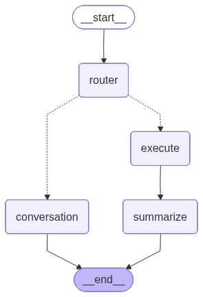
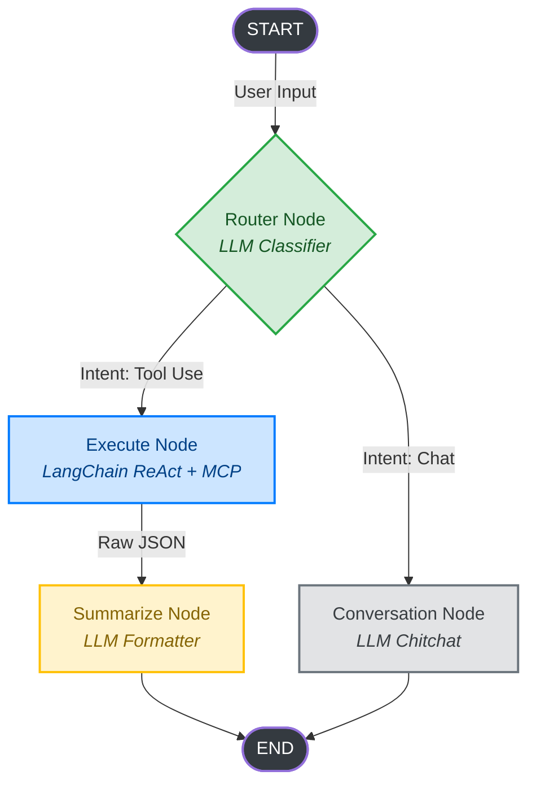
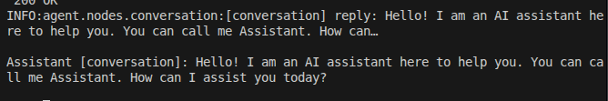
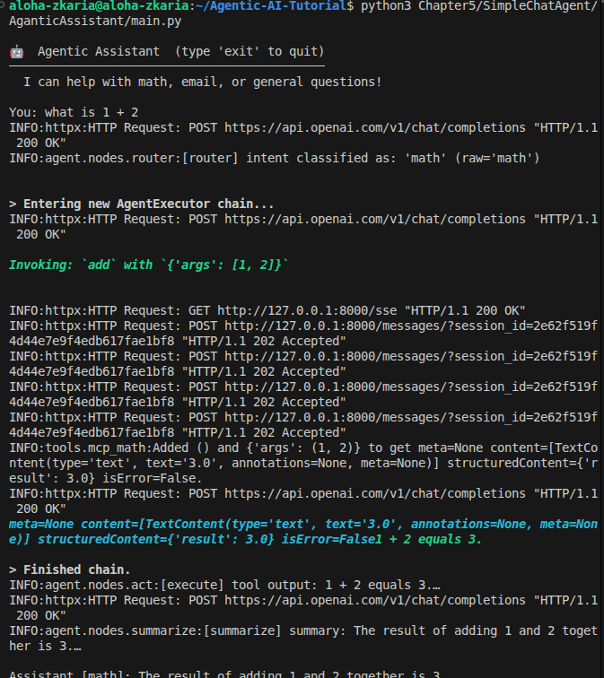
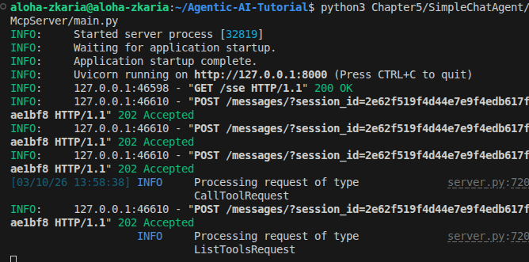
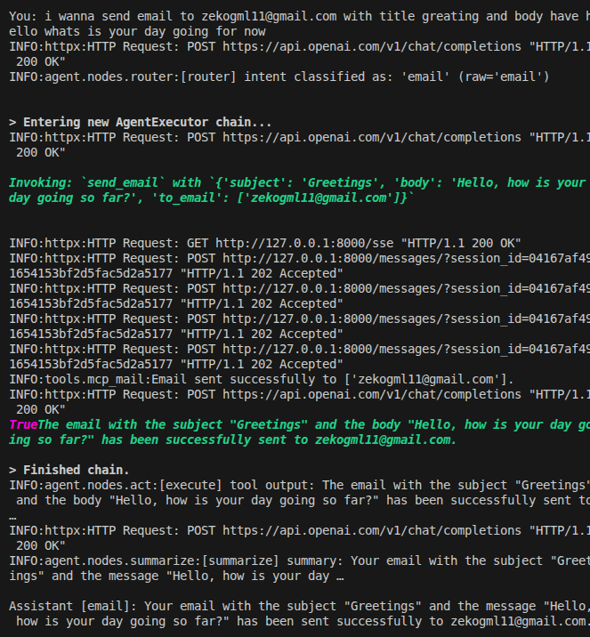
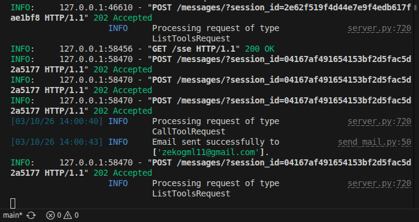
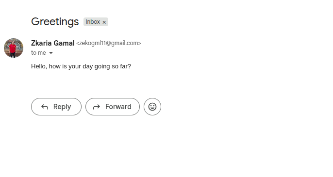

# 🤖 Chapter 5: Multi-Node LangGraph Agent with MCP Tools

Welcome to **Chapter 5**, where we build a powerful, multi-node autonomous agent using **LangGraph** and the **Meta Communication Protocol (MCP)**. This agent routes user requests intelligently to different execution nodes and uses a local MCP server to execute tools like solving math equations and sending emails.

---

## 🏗️ Architecture Overview

Our agent employs a multi-node **StateGraph** design to efficiently process different types of intents. This separates the "thinking" (routing) from the "doing" (execution), which is a core pattern in advanced Agentic AI.



### 📊 The LangGraph Flow (Mermaid)



### 🧠 Deep Dive: The Agentic Flow

To truly understand how this agent operates autonomously, let's break down the responsibility of each node in our graph:

1. **`router.py` (The Brain)**: 
   - *Purpose*: Decides **what** needs to be done. 
   - *How it works*: It takes the user's raw input and uses a low-latency LLM call with a strict system prompt to classify the intent into specific "buckets" (e.g., `math`, `email`, `conversation`). This is faster and cheaper than giving a massive ReAct agent every instruction possible.

2. **`execute.py` (The Hands)**:
   - *Purpose*: Performs the **actions**.
   - *How it works*: If the intent requires external tools, the state moves here. This node runs a LangChain `create_tool_calling_agent`. Crucially, instead of writing complex local functions, this agent natively binds to tools exposed by our **FastMCP Server**, allowing it to safely interact with the file system, network, or external APIs.

3. **`summarize.py` (The Mouth)**:
   - *Purpose*: Translates raw data into **human language**.
   - *How it works*: External tools (like IMAP email fetching or database queries) usually return raw, ugly JSON or nested arrays. The Summarize node takes this `tool_results` state and hands it to an LLM to generate a polite, conversational answer for the user. 

4. **`conversation.py` (The Fallback)**:
   - *Purpose*: Handles **chitchat**.
   - *How it works*: If the router determines no tools are needed (e.g., "Hello!", "Who are you?"), the graph bypasses execution entirely and sends the conversational history to a standard LLM to reply directly, saving tokens and tool-calling execution time.

---

## 🔌 What is MCP and Why Use It?

The **Model Context Protocol (MCP)** is an open standard introduced by Anthropic that standardizes how AI models connect to data sources, tools, and environments. 

In previous chapters, we defined Python functions directly inside our LangChain code. In this chapter, we level up by moving our tools into a standalone **FastMCP Server**. 

Why is this architectural shift so powerful for Agentic AI?

1. **Security & Isolation**: The LLM agent (the "brain") never has direct access to your email passwords or file system. It only communicates with the MCP server via strict HTTP Server-Sent Events (SSE). The server acts as a secure boundary.
2. **Reusability**: Once you build an MCP server (like our Mail/Math server), you can plug it into *any* MCP-compatible client. You can use these exact same tools in LangChain, Claude Desktop, Cursor, or your own custom UIs without rewriting any tool logic.
3. **Scalability**: The "Brain" (inference) and the "Hands" (tool execution) are completely decoupled. You can host the LangGraph agent on AWS and run the MCP Server securely on your local corporate intranet to access private databases.

---

## 🚀 Setting Up the Project

This project consists of two main components:
1. **MCP Server**: Exposes tools over Server-Sent Events (SSE).
2. **Agentic Assistant**: The interactive LangGraph client.

### 1. Configure the Environment
Copy the example environment files and fill in your credentials:
```bash
cp Chapter5/SimpleChatAgent/McpServer/.env.example Chapter5/SimpleChatAgent/McpServer/.env
cp Chapter5/SimpleChatAgent/AganticAssistant/.env.example Chapter5/SimpleChatAgent/AganticAssistant/.env
```

**Required API Keys**:
- `OPENAI_API_KEY` (in `AganticAssistant/.env`)
- SMTP/IMAP Mail configuration (in `McpServer/.env`)

### 2. Start the MCP Server
In a new terminal window, start the FastMCP server which runs on `http://127.0.0.1:8000`:
```bash
python3 Chapter5/SimpleChatAgent/McpServer/main.py
```

### 3. Run the Agent
In your main terminal, start the interactive assistant CLI:
```bash
python3 Chapter5/SimpleChatAgent/AganticAssistant/main.py
```

---

## 📸 Demos and Features

### 💬 General Conversation
The agent can route general greetings directly to the conversation node.


### 🧮 Math Execution
When asked a math question, the router directs it to the MCP server. 

*(Server View)*:


### 📧 Email Management
The agent can compose, send, and read emails securely via the MCP tools.

*(Server View)*:


Proof of delivery to a real inbox:


---

## 🛠️ Exploring the Code
- **`agent/graph.py`**: The core graph definition wiring the nodes together.
- **`agent/nodes/`**: Individual implementations for routing, executing, summarizing, and conversational logic. -> [Read the Assistant Guide](./AganticAssistant/README.md)
- **`McpServer/tools/`**: The standalone tool definitions injected into the MCP Server. -> [Read the MCP Guide](./McpServer/README.md)

---

## 🦙 Running Locally with Ollama (No API Keys!)

If you don't want to use OpenAI or Gemini, you can run this entire agentic workflow **100% locally and free** using [Ollama](https://ollama.com/).

### 1. Start Ollama
Ensure Ollama is running on your machine and you have pulled a capable tool-calling model (like `llama3.1` or `mistral`):
```bash
ollama run llama3.1
```

### 2. Update the Agent Nodes
In any of the nodes (`router.py`, `conversation.py`, `execute.py`, `summarize.py`), simply swap out the `langchain_openai` import for `langchain_ollama`:

**Change this:**
```python
from langchain_openai import ChatOpenAI
llm = ChatOpenAI(model="gpt-3.5-turbo")
```

**To this:**
```python
from langchain_ollama import ChatOllama
llm = ChatOllama(model="llama3.1", temperature=0)
```

Because LangChain provides standardized interfaces, the rest of the graph and tool-calling code will work seamlessly!
